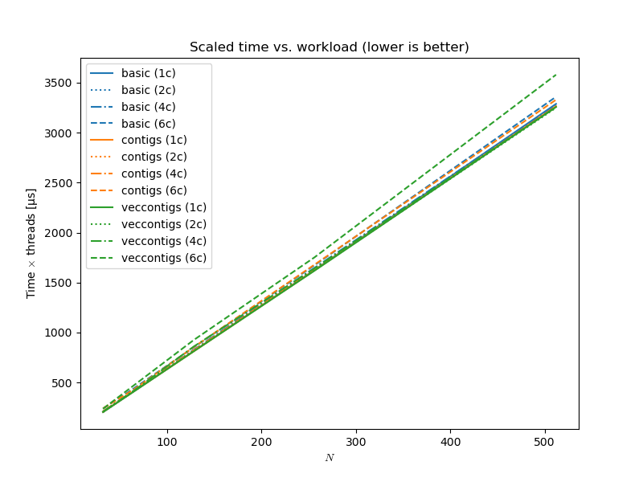
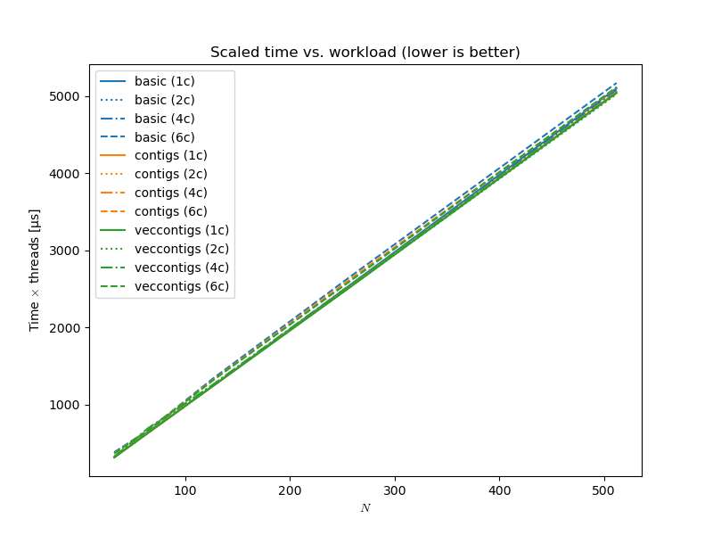

# eigen-cont-malloc

A sandbox where I look at parallelizing computations in Eigen

Be sure to disable Turboboost:

```bash
echo "1" | sudo tee /sys/devices/system/cpu/intel_pstate/no_turbo
```

To get consistent results, run the binaries with OpenMP command line options which set the thread affinities and binds them, similar to

```bash
GOMP_CPU_AFFINITY="0-15:2" OMP_PROC_BIND=TRUE  ./par --benchmark_min_time=4s --benchmark_min_warmup_time=1
```

## results

### `-march=native`



### no `-march=native`


